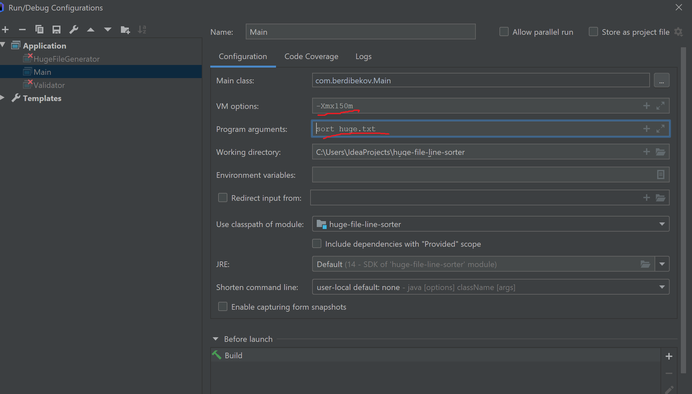

 The results of the completed test task:
 -
 1. Huge-file-sorter - console java application that sorts files that does not fit into RAM. 
 App implements merge algorithm https://en.wikipedia.org/wiki/Merge_algorithm.

 1. Functionality
    - Sorting Big file that does not fit into RAM. Min RAM required id 150 MBytes.In the future,
    you can add functionality (setting the required memory size).

    !!! This Functionality requires normal RAM space !!!
    - generating a file with the specified parameters (max line length,number of lines in the text)
    - validating the file is a sorted input file

#Commands

+ sort              - Sort file. 

                        - sorter sort huge.txt
                        
                        - sorter sort C:\Users\Berdibekov\IdeaProjects\huge-file-line-sorter\dist\result\huge.sorted.txt
                       

+ generate          - generates file.

                    - sorter generate [file name] [max line length] [number of lines]
                    
                    - sorter generate huge.txt 300 4000000

+ Validate      - validate .

                    - sorter validate [source file path] [sorted file]
                    
                    - sorter validate huge.txt .\result\huge.sorted.txt

#Compile and run instruction

- Run from Intellij IDEA.
    - In Intellij IDEA click to project folder->add framework support->Maven.
    - Lunch src\main\java\com\berdibekov\Main.java with command and parameters [sort huge.txt].
    

- From Console
    - Windows
        - run make.bat
        - run dist\sorter.bat
    - UNIX (Linux,Mac OS)
        - sh make.sh
        - sh dist\sorter.sh
        